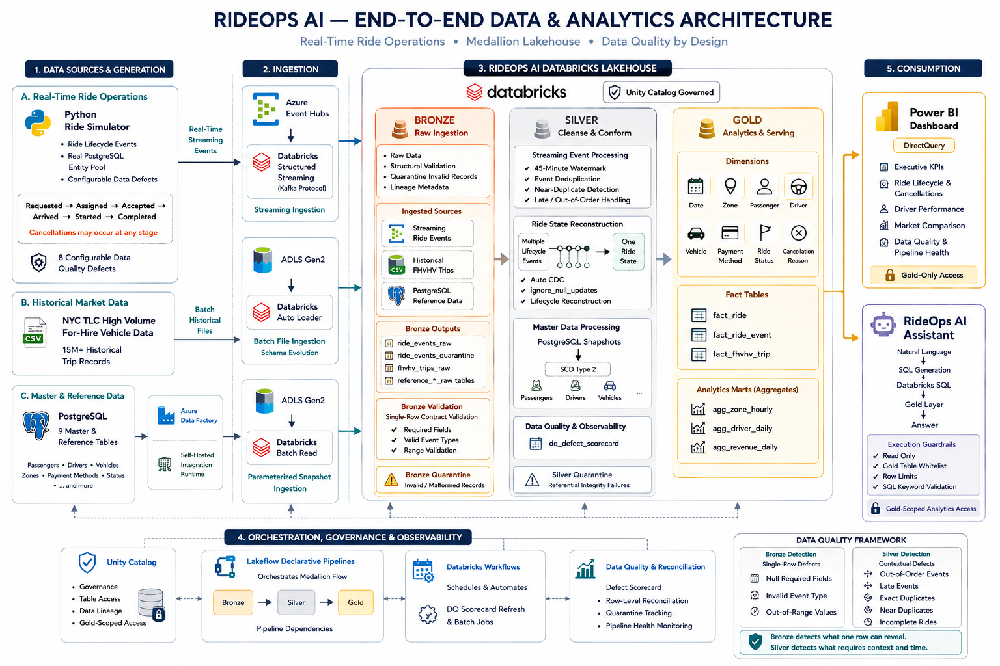
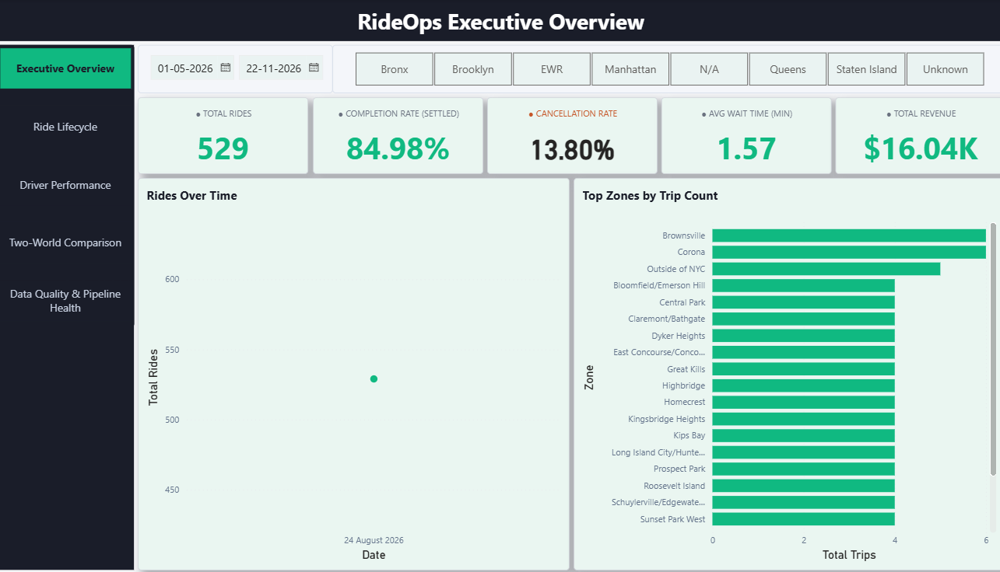
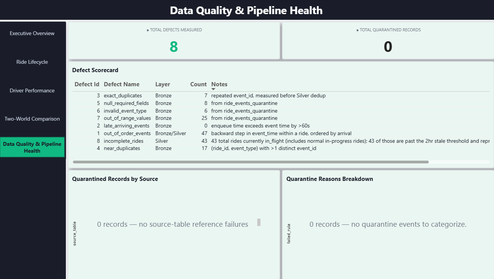
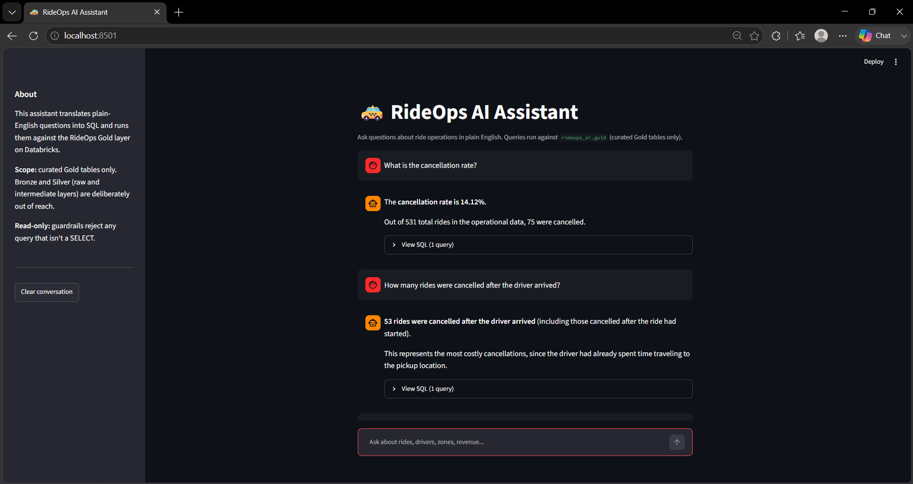

RideOps AI

A real-time ride operations platform built on a medallion lakehouse, with a deliberately broken data source.
Three heterogeneous sources feed a governed Databricks lakehouse, surfaced through a five-page Power BI dashboard and a natural-language analytics assistant. Every data quality defect it catches was injected on purpose, and every number it reports is reconciled row-by-row back to source.


## Architecture

<p align="center">
  
</p>


## Why this project exists
Most portfolio pipelines move clean data from A to B and call it done. Real pipelines spend most of their life dealing with data that is late, duplicated, malformed, or simply missing.
So this one generates its own bad data on purpose. A Python simulator emits realistic ride lifecycle events with eight distinct defect types injected at configurable rates. The pipeline's job is to catch each one at the layer that can actually detect it, and to prove it caught them with a measured scorecard rather than an assertion.
The result is a platform where you can point at any figure on the dashboard and trace it back to source, and where "data quality" is a number you can query, not a claim in a README.

## 📥 Data Sources

RideOps AI combines three heterogeneous data sources:

### ⚡ Operational Events — Streaming

A Python simulator generates realistic ride lifecycles and streams approximately **50 events/sec** to Azure Event Hubs.

`requested → assigned → accepted → arrived → started → completed`

Cancellation can occur at any pre-completion stage.

Passengers, drivers, vehicles, and zones are sampled from live PostgreSQL master data, ensuring that generated events maintain valid foreign-key relationships.

The simulator includes:

- Realistic lifecycle timing and trip durations
- NYC-style fare calculation
- Configurable data-quality defect injection
- Batched event delivery to Azure Event Hubs

### 📊 Historical Market Data — Batch

Public NYC TLC HVFHV trip records provide a historical market benchmark.

The dataset is scoped to **HV0003 (Uber)**, reducing approximately **22M source records to 15.35M records**. Data quality issues identified during profiling follow an explicit **flag, don't drop** strategy.

### 🗄️ Master & Reference Data — Batch Snapshot

Nine PostgreSQL tables are ingested through a metadata-driven Azure Data Factory pipeline:

`Get Metadata → ForEach → Copy`

The pipeline runs through a Self-Hosted Integration Runtime and is configuration-driven, allowing additional source tables to be added without creating new pipeline logic.

---

## 🏗️ Medallion Architecture

RideOps AI follows a **Bronze → Silver → Gold lakehouse architecture**.

### 🥉 Bronze — Raw Ingestion

Raw streaming, historical, and master data is landed with schema validation, quarantine handling, and full source lineage.

- Event Hubs → Structured Streaming
- ADLS Gen2 → Auto Loader
- PostgreSQL snapshots → Metadata-driven batch ingestion
- Invalid records → Quarantine tables
- Source and ingestion metadata attached to every record

### 🥈 Silver — Cleansed & Conformed

The Silver layer handles data quality, conformance, and entity reconstruction.

- SCD Type 2 history tracking for master data
- Referential integrity validation
- Watermark-based streaming deduplication
- Duplicate detection by both `event_id` and lifecycle stage
- Ride lifecycle reconstruction into one row per `ride_id`
- Auto CDC with `ignore_null_updates=True`
- Duration metrics, cancellation analysis, and stale ride detection

### 🥇 Gold — Analytics Star Schema

The Gold layer provides analytics-ready dimensional models.

| Type | Tables |
|---|---|
| **Dimensions** | 8 |
| **Facts** | 3 |
| **Analytics Marts** | 3 |

Key models include:

`dim_date` · `dim_zone` · `dim_passenger` · `dim_driver` · `dim_vehicle`

`fact_ride` · `fact_ride_event` · `fact_fhvhv_trip`

`agg_zone_hourly` · `agg_driver_daily` · `agg_revenue_daily`

Surrogate key generation is selected based on table characteristics, using rebuild-safe keys for stable dimensions and deterministic SHA-256 fingerprints for continuously growing historical fact data.

---

## 🛡️ Data Quality Framework

Eight defect types are injected at configurable rates. Each is caught at the layer that can actually detect it.

| # | Defect | Caught At | Why There |
|---|---|---|---|
| 1 | Out-of-order events | Silver | Needs arrival-order comparison |
| 2 | Late-arriving events | Silver | Needs event-time vs processing-time |
| 3 | Exact duplicates | Silver | Needs cross-row comparison |
| 4 | Near-duplicates | Silver | Needs cross-row comparison |
| 5 | Null required fields | **Bronze** | Detectable from one row |
| 6 | Invalid `event_type` | **Bronze** | Detectable from one row |
| 7 | Out-of-range values | **Bronze** | Detectable from one row |
| 8 | Incomplete rides | Silver | Needs the passage of time |

**Bronze catches what a single row reveals. Silver catches what only context reveals.**

Two quarantine tables serve two purposes: `bronze.ride_events_quarantine` holds schema and contract violations, `silver.sv_quarantine` holds cross-table referential integrity failures.

### The Scorecard

`silver.dq_defect_scorecard` reports a **measured count** per defect type, making detection provable rather than asserted.

| defect_id | defect_name | layer | count |
|---|---|---|---|
| 1 | out_of_order_events | Bronze/Silver | 801 |
| 3 | exact_duplicates | Bronze | 250 |
| 4 | near_duplicates | Bronze | 341 |
| 5 | null_required_fields | Bronze | 186 |
| 6 | invalid_event_type | Bronze | 137 |
| 7 | out_of_range_values | Bronze | 353 |
| 8 | incomplete_rides | Silver | 427 |

---

## 🔍 Reconciliation

Every row is accounted for at each layer boundary, with a documented reason for every transition.

```
Simulator emits                        3,081 events
  └─ 39 quarantined at Bronze (defects 5, 6, 7)
ride_events_raw                        3,042 events
  └─ 24 removed by Silver dedup (defects 3, 4)
sv_ride_events                         3,018 events
sv_ride_state                            531 rides
  ├─ completed        413
  ├─ cancelled         75
  └─ in_flight         43
fact_ride  531 rides  ·  fact_ride_event  3,018 events
```

Losses are never assumed benign. Each maps to a specific, intentional rule.

---

## 📊 Power BI Dashboard

Five pages over **DirectQuery**, so figures reflect live pipeline state rather than a stale import. 25 measures, 25 relationships, persistent navigation, cross-filtering slicers.

| Page | Answers |
|---|---|
| Executive Overview | How is the operation performing right now? |
| Ride Lifecycle & Cancellations | Where in the funnel do rides fail, and why? |
| Driver Performance | Who is performing well, and on what volume? |
| Two-World Comparison | How does our demand compare to the NYC market? |
| Data Quality & Pipeline Health | Are the numbers trustworthy? |

<p align="center">
  
</p>

<p align="center">
  
</p>

**A finding the dashboard surfaced:** 70% of cancellations occur at the `arrived` stage, after the driver has already reached the pickup point. That is the most expensive moment to lose a trip, and it is invisible without reconstructing ride state from raw events.

---

## 🤖 AI Assistant

A natural-language interface over the same Gold layer. Ask in plain English, get an answer plus the SQL that produced it.

<p align="center">
  
</p>

**Governance is layered, not assumed.** Schema scoping means the agent never *sees* Bronze or Silver. Execution-time guardrails mean it cannot *reach* them even with a fully-qualified query — a distinction verified empirically, since schema scoping alone proved insufficient.

Four guardrail layers: read-only enforcement, table whitelist, row limits, comment-aware keyword scanning.

**Deliberately lightweight.** No vector store, no RAG, no multi-agent orchestration. Fourteen tables fit comfortably in context; retrieval infrastructure would add complexity without adding capability.

---

## 🐛 Engineering Challenges

Five production-grade defects found and fixed. Three were **silent** — the pipeline reported success while producing wrong data.

| Symptom | Root Cause | Fix |
|---|---|---|
| Zero completed rides; one sat open 5.5 days against an 8-minute lifecycle | Fare fields serialized with `str()` against a `DoubleType` schema — Spark rejected the whole record into `_corrupt_record` | `float()` instead of `str()` |
| 1,234 cancelled events quarantined as `malformed_json` | `CANCELLATION_REASONS.get(4, 4)` returned the dict *value* (`"Payment Failed"`) instead of the key | Use the integer key directly |
| `Avg Fare` reported **$960.73** on trips capped near $40 | Out-of-range check tested only for *negative* values; the injector also produces `99999.99` | Added upper bounds — corrected to **$37.18** |
| Defect 5 fired at its configured rate but quarantined nothing | Injector nulled `payment_method_id`, a field Bronze's contract never checks | Aligned injector to Bronze's `STAGE_REQUIRED_FIELDS` |
| Two Power BI cards errored under any filter | `COUNTROWS()` cannot fold to SQL once a filter crosses a relationship | `CALCULATE(COUNT(fact_ride[ride_id]))` |

The revenue bug is the one worth dwelling on: the number *looked* plausible until the distribution was queried directly. **0.9% of rides accounted for 96% of reported revenue.**

---

## 🧭 Design Decisions

| ID | Decision | Reasoning |
|---|---|---|
| ADR-001 | Bronze catches only single-row defects | Cross-row detection needs state Bronze doesn't have |
| ADR-002 | Two worlds never merged | No shared entities, no overlapping time range — a union would fabricate a relationship |
| ADR-003 | Flag, don't drop | Soft signals become boolean columns; only hard violations are quarantined |
| ADR-004 | HV0003 filter applied in Silver | Business scope, not data quality — Bronze keeps all 22M rows so scope can widen |
| ADR-005 | SCD2 in Silver, current-only in Gold | History preserved where cheap; presentation layer stays simple |
| ADR-006 | 45-minute watermark | Sized against the injector's own worst-case hold-back window |
| ADR-007 | No dbt | Value lies in portability and team handoffs — neither applies here |
| ADR-008 | Minimal orchestration | Lakeflow resolves layer dependencies natively; scheduling added only where a real gap existed |

---

## 📁 Repository Structure

```
rideops-ai/
├── database/
│   ├── generators/          # Entity pool, timing, fares, defect injection
│   ├── ddl/                 # PostgreSQL schema
│   └── seed/                # Master data seeding
├── config/
│   └── simulator_config.yaml
├── transformations/
│   ├── bronze/              # Event Hubs, Auto Loader, Postgres reference
│   ├── silver/              # SCD2, dedup, ride state, DQ observability
│   └── gold/                # Dimensions, facts, aggregate marts
├── simulator.py
└── docs/

rideops-assistant/
├── src/
│   ├── connection.py        # SQLAlchemy → Databricks, Gold-scoped
│   ├── agent.py             # LangGraph ReAct agent
│   ├── guardrails.py        # Read-only, whitelist, row limit
│   └── prompts.py           # Domain context
└── app.py                   # Streamlit chat UI
```

---

## ⚙️ Running It

**Prerequisites:** Azure subscription (Event Hubs, Data Factory, ADLS Gen2), Databricks workspace with Unity Catalog, PostgreSQL, Python 3.12+

```bash
# 1. Seed the source database
psql -f database/ddl/schema.sql
python database/seed/seed_master_data.py

# 2. Configure — copy .env.example to .env and fill in
#    POSTGRES_*, EVENT_HUBS_CONNECTION_STRING, EVENT_HUBS_HUB_NAME

# 3. Create a Lakeflow pipeline pointed at transformations/
#    Target catalog: rideops_ai · Mode: Continuous
#    Config: RideOps-Eventhub-Namespace, RideOps-Eventhub, connection_string

# 4. Generate data
python simulator.py --duration=1200

# 5. Full-refresh dq_defect_scorecard (see Known Limitations)

# 6. Run the assistant
cd rideops-assistant && pip install -r requirements.txt && streamlit run app.py
```

---

## ⚠️ Known Limitations

Documented rather than hidden.

- **`dq_defect_scorecard` needs a manual refresh.** As a batch table downstream of streaming sources, it does not reliably re-trigger in Continuous mode.
- **Assume Referential Integrity drops NULL-key rows.** Enabled for DirectQuery performance. Rides whose `requested` event was quarantined carry a NULL `date_key` and are excluded from date-sliced visuals — a deliberate, quantified trade-off.
- **Non-overlapping time ranges.** Operational and historical data cover different periods, so cross-world comparison is volumetric and geographic, not temporal.
- **Metric definitions are explicit.** `Cancellation Rate` divides by all rides including in-flight; `Completion Rate (Settled)` divides only by concluded rides. Both are exposed so the distinction is visible.
- **The simulator stands in for a production event source.** In a real system these events come from the ride-hailing application itself.

---

## 🚀 What's Next

- Databricks Workflows for the batch ingestion paths, closing the scorecard refresh gap
- Overlapping time ranges between the two worlds, making comparison temporal as well as geographic
- Point-in-time joins against the SCD2 history already retained in Silver
- A semantic layer so the assistant uses canonical metric definitions rather than deriving them per query
